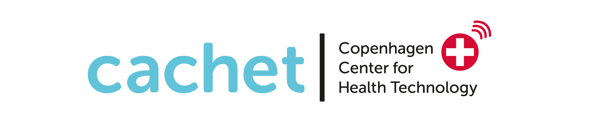

# CARP IPDM-GO REPORT

##
The Copenhagen Center for Health Technology (CACHET) Research Platform (CARP) enables researchers to run mobile health (mHealth) studies where data is collected on participant's smartphones and wearable devices. Data is securely uploaded and managed in a hosting infrastructure managed by the Technical University of Denmark.

CARP is a platform for running research studies in the health domain – also known as Digital Phenotyping. Such studies range from technical feasibility studies of novel technology to large-scale clinical studies. The platform is very versatile both in terms of support for different types of health domains, as well as in terms of technical support and configuration.

Environments 
-----------------

> Changing the **[CARP]** environment: 
> Switch `url` function (`carp_controller.py`) as follows:
>  -  *BASE_URL["production"]..* 
>  -  *BASE_URL["staging"]..**  
>  -  *BASE_URL["development"]..* 
>  -  *BASE_URL["test"]..*
>  -  *BASE_URL["local"]..*

Install requirements
-----------------

**Provision for Production:** 
 >  - ~`cd` into `carp.client-api-flask` directory and use the bash-command: 
 > - bash deployment.sh production up
 > - Done :)

**Run locally:**
>  - ~`cd` into `carp.client-api-flask` directory and use the python-command: 
> - python run.py
>  - Done :)

Dependencies
-----------------
- [CARP PYTHON API](https://pypi.org/project/carp-python-api)
         
References
-----------------
- Copenhagen Center for Health Technology [CACHET](https://cachet.dk)
- [CARP Webpage](https://carp.cachet.dk).
- [CANS Management Dashboard](https://cans.cachet.dk).
- [CARP Core](https://carp.cachet.dk/core/)

